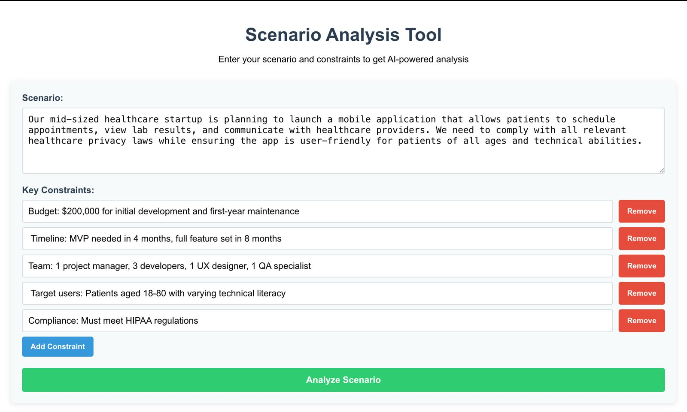
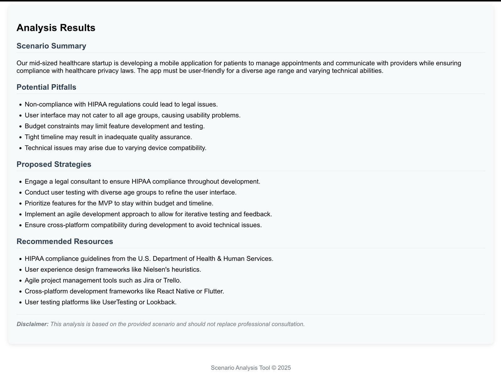
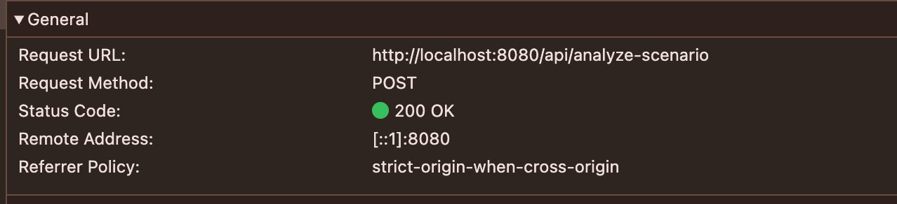
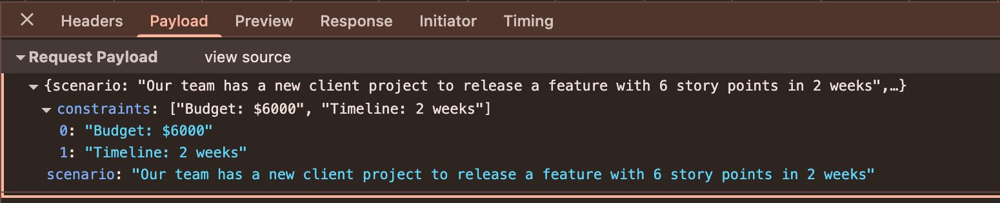
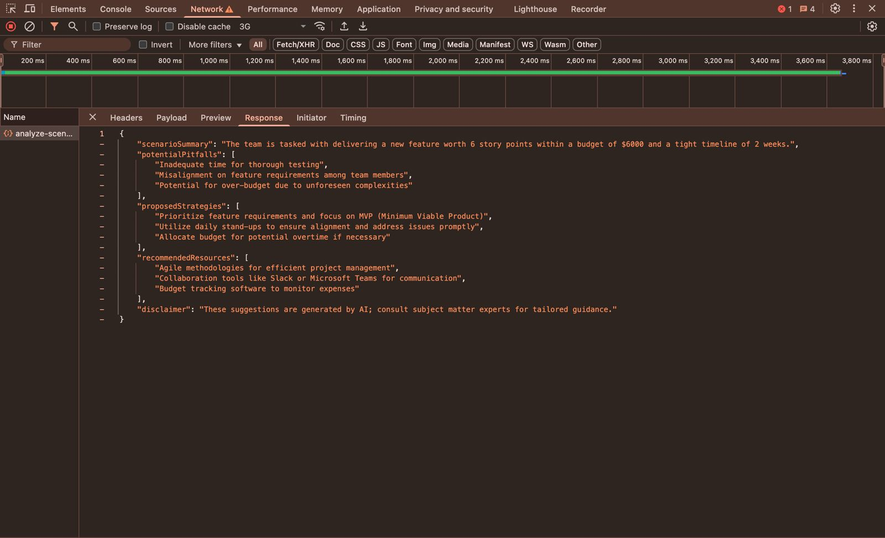

# Scenario Analyzer

A full-stack web application that leverages AI to analyze business scenarios and provide structured recommendations based on user constraints.

## Table of Contents
- [Features](#features)
- [Directory Structure](#directory-structure)
- [Prerequisites](#prerequisites)
- [Running the Application](#running-the-application)
- [Testing](#testing)
- [API Documentation](#api-documentation)
- [AI Implementation Details](#ai-implementation-details)


## Features

- Input form for describing scenarios and specifying constraints
- AI-powered analysis providing:
  - Scenario Summary
  - Potential Pitfalls
  - Proposed Strategies
  - Recommended Resources
  - Disclaimer
- Spring Boot backend with OpenAI GPT-4 integration
- React frontend with responsive design

## Directory Structure

```
/
├── SpringBoot/                 # Backend Spring Boot application
│   ├── src/
│   │   ├── main/
│   │   │   ├── java/com/example/analyzer/
│   │   │   │   ├── controller/    # REST controllers
│   │   │   │   ├── model/         # Data models
│   │   │   │   ├── service/       # Business logic & OpenAI integration
│   │   │   │   └── ScenarioAnalyzerApplication.java
│   │   │   └── resources/
│   │   │       └── application.properties  # Configuration
│   │   └── test/                  # JUnit tests
│   ├── mvnw                       # Maven wrapper
│   └── pom.xml                    # Maven dependencies
└── react-frontend/               # React frontend
    ├── public/
    ├── src/
    │   ├── components/            # React components
    │   ├── App.js                 # Main application component
    │   └── App.css                # Styles
    └── package.json              # NPM dependencies
```

## Prerequisites
- Java 17 or higher
- Node.js 14 or higher
- npm 6 or higher
- OpenAI API key
- Modern web browser (Chrome, Firefox, Safari, Edge)
- Internet connection for API calls

**Important**: Instead of hardcoding your API key, set it as an environment variable when running the application.


## Running the Application

### Backend

1. Navigate to the SpringBoot directory:
   ```bash
   cd SpringBoot
   ```

2. Build and run the Spring Boot application with your API key:
   ```bash
   OPENAI_API_KEY=your_api_key_here ./mvnw spring-boot:run
   ```

3. Verify the backend is running at http://localhost:8080

### Frontend



1. Navigate to the react-frontend directory:
   ```bash
   cd react-frontend
   ```

2. Install dependencies:
   ```bash
   npm install
   ```

3. Start the development server:
   ```bash
   npm start
   ```

4. Access the application at http://localhost:3000

## Testing

The Spring Boot application includes comprehensive JUnit tests to ensure the reliability and functionality of the backend components.

### Controller Tests

`ScenarioAnalysisControllerTest.java` validates that:
- The API endpoint correctly accepts POST requests with scenario data
- Responses are formatted correctly with appropriate status codes
- Validation errors are handled properly for invalid requests

### Service Tests

`AiServiceTest.java` tests the core AI integration functionality:
- Mocks the OpenAI API calls to test without making actual external requests
- Ensures proper parsing of OpenAI responses into structured data
- Tests error handling for API failures

### Running Tests

To run the JUnit tests:
```bash
cd SpringBoot
./mvnw test
```

## API Documentation

### Endpoint: POST /api/analyze-scenario


Analyzes a scenario and returns structured recommendations.

#### Request Body:



#### Response Body:


## AI Implementation Details

The application uses OpenAI's GPT-4o-mini model to analyze business scenarios. The service:

1. Takes an input of a detailed prompt with the user's scenario and constraints
   - Minimum Constraint Frontend Error Handling
     
3. Makes API calls to OpenAI with appropriate parameters:
   - Temperature: 0.3 (for more consistent outputs)
   - Max tokens: 1000 (for complete but concise responses)
   - Top_p: 0.95 (to reduce randomness further)
4. Parses the JSON response into a structured format for the frontend

The AI prompt has been carefully engineered to provide structured analysis with:
- Chain-of-thought reasoning process
- Strict output formatting requirements
- Verification steps to ensure valid JSON output

You can modify the prompt structure in `AiService.java` if you need to adjust the AI's analysis approach.


